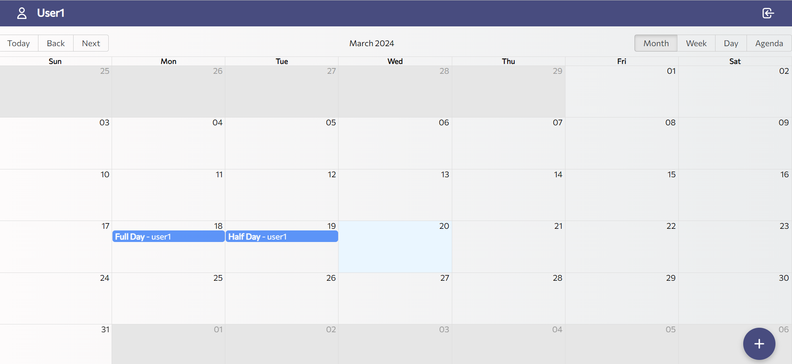

# MERN Attendance

Attendance web application for adding, editing, deleting or listing other people's attendance. Developed using the MERN stack.

_API, CRUD, Auth system, JWT, Redux, Calendar._

## [Try demo](https://attendance-client-five.vercel.app)




## Deployment 📦

```bash
# Open terminal in project path and run
$ cd server
$ npm start


# Open another terminal in project path and run
$ cd client
$ npm start
```

Open [http://localhost:3000](http://localhost:3000) to view it in your browser.

## Built with 🛠️

- [React](https://es.reactjs.org/) - Frontend framework
- [React Redux](https://react-redux.js.org/) - State management
- [Node.js](https://nodejs.org/) - Javascript runtime environment
- [Express.js](https://expressjs.com/) - Backend framework
- [MongoDB](https://www.mongodb.com/) - NoSQL database

---

⌨️ with ❤️ by [Ashutosh Singh](https://github.com/cybemonk01) 😊
